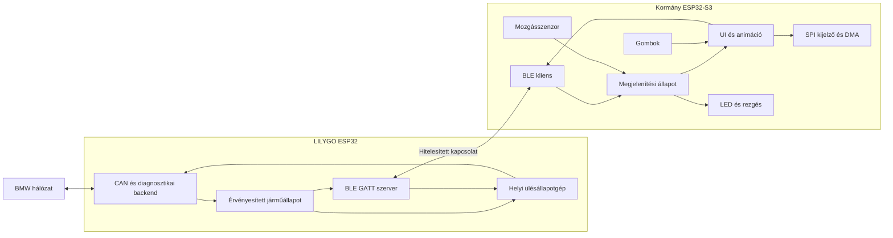

# Kétmodulos rendszer és fejlesztési architektúra

Állapot: tervezési alap, nem megvalósított vagy bemért firmware. Céljármű: BMW E90, 2007, N52B25, iDrive nélkül. A [kilenc agentszerep](../../agents/README.md) két firmware-t fejleszt; a szerepek nem az ESP32-n futó feladatok. A közös adatszerződéseket a [contracts.md](contracts.md) határozza meg.

## Rendszerhatárok

A LILYGO autóoldali átjáró fogadja és értelmezi a CAN-adatokat, kezeli a diagnosztikai kéréseket és helyben hajtja végre az engedélyezett ülésautomatika állapotgépét. A kormány általános, értelmezett járműadatokat kap, megjelenít és felhasználói szándékokat küld. Nem tartalmaz BMW CAN-azonosítókat vagy ülésvezérlő nyers kereteket.

A LILYGO elhelyezése szabad. A meglévő hardver módosítás nélküli csatlakoztathatósága és az összes szükséges funkció elérhetősége továbbra is külön ellenőrzendő függőség. Ezt a terv nem tekinti bizonyítottnak. A dekódoló, a kezelőfelület és a rádiós protokoll addig rögzített adatokkal és szimulált backenddel fejleszthető.

Kiinduló szoftverválasztás: ESP-IDF 6.x / FreeRTOS (jelenleg rögzített cél: v6.1), BLE-hez NimBLE, UI-hoz LVGL. Az első buildfeladat konkrét, egymással ellenőrzött verziókat rögzít. Az eredeti firmware könyvtárverziója önmagában nem követelmény az új projekthez.

## A kormány lefedendő hardverei

Az alábbi GPIO-k az eredeti firmware alapján ismertek; nem helyettesítik a fizikai bekötés ellenőrzését. Részletes térkép: [README](../../README.md#firmware-gpio-map).

| Egység | Jelenlegi ismeret | Felelős |
|---|---|---|
| ESP32-S3 és FreeRTOS | Kétmagos vezérlő, feladatok, watchdog, indulás és hibakezelés | Kormányplatform |
| TFT | ST7789/ST7789VW, 320 × 172; MOSI 15, CLK 16, CS 17, DC 18, RESET 13 | Kormányplatform: átvitel; UI: rajzolás |
| Háttérvilágítás | GPIO38; bekapcsolás ismert, dimmelés lehetőségét ellenőrizni kell | Kormányplatform |
| Két LED-lánc | GPIO3 és GPIO4, firmware szerint 24–24 címzett LED; a tulajdonos szerint lánconként az utolsó a gombot világítja, így 23–23 RPM-pixel marad; fizikai bal/jobb hozzárendelés ellenőrizendő | Periféria |
| Két saját gomb | K1 GPIO12, K2 GPIO11; aktív alacsony | Periféria, UI eseményfogyasztó |
| Vibramotor vezérlése | GPIO21, aktív magas; véges idejű minták, alaphelyzetben kikapcsolva | Periféria |
| Szenzorillesztés | BNO055-öt használó firmware: SDA39, SCL40, engedélyezés10, cím 0x28 | Periféria/szenzor |
| PSRAM | 8 MB; képi erőforrások és megfelelően kezelt munkaterületek | Kormányplatform, UI |
| SPI flash | 32 MiB; firmware, képek, betűk, konfiguráció és későbbi OTA-partíciók | Integrátor, Wi-Fi/frissítés |
| USB | Natív USB Serial/JTAG; fejlesztési napló és diagnosztika | Kormányplatform |
| Tápkörök, csatlakozók | Fotózott alkatrészek; teljes kapcsolás és csatlakozósorrend ismeretlen | Integrátor nyilvántartása |

A BNO055 gyorsulásmérőt, giroszkópot és magnetométert integráló orientációs szenzor, nem irányjelző-vezérlő. A konkrét panelen a jelenlétét és azonosítóját még ki kell olvasni. A forgó kormány koordinátarendszere és a közeli fémek/mágneses zavarok miatt a mért irány vagy gyorsulás nem nevezhető automatikusan járműiránynak vagy járműgyorsulásnak. [Bosch termékleírás](https://www.bosch-sensortec.com/products/smart-sensors/bno055/)

A gyári multifunkciós gombok és váltófülek külön egységek. Nem feltételezzük, hogy közvetlenül ennek a kijelzőpanelnek a GPIO-ira csatlakoznak. Bevonásukhoz külön bizonyított adatút szükséges.

## Kétmagos kormány-runtime

A kezdeti felosztás normál, kikapcsolt Wi-Fi-jű üzemre:

| Terület | Tervezett végrehajtás | Korlát |
|---|---|---|
| BLE vezérlő/host és adatfogadás | Elsődlegesen CPU0, a kiválasztott IDF konfigurációja szerint | Callback csak ellenőriz és sorba állít |
| UI, animáció, LVGL objektumok | Egyetlen tulajdonos task, CPU1 | Nem vár hálózatra, szenzorra vagy flashírásra |
| Gombfeldolgozás | Rövid, az UI-nál magasabb prioritású task; kezdetben CPU1 | Debounce időzítve, nincs aktív várakozás |
| LCD-átvitel | Aszinkron SPI/DMA | Puffer csak befejezés után használható újra |
| LED-frissítés | RMT hardver, összevont legfrissebb állapot | Nincs megszakítást hosszan tiltó bitenkénti hajtás |
| Szenzorolvasás | Alacsonyabb prioritás, korlátozott I²C timeout | Hiányzó szenzor sem blokkolhatja a UI-t |
| Naplózás, konfiguráció | Korlátozott, alacsony prioritás; flashírás halasztva | Nincs képkockánkénti napló vagy NVS-írás |

A konkrét prioritásszámok, veremméretek és affinitások a rögzített IDF-verzió és mérések alapján véglegesítendők. A két mag memóriát és erőforrásokat oszt meg; a maghoz kötés nem jelent teljes elszigetelést. Mindkét magon maradjon idő az idle és rendszerfeladatoknak. [ESP-IDF FreeRTOS](https://docs.espressif.com/projects/esp-idf/en/stable/esp32s3/api-reference/system/freertos_idf.html)

LVGL objektumokat kizárólag a UI-task módosít. A többi komponens eseményt vagy állapotot ad át; a DMA-befejezés kezelése a kiválasztott LVGL-port támogatott eljárását követi. [LVGL szálkezelés](https://lvgl.io/docs/open/9.4/details/integration/overview/threading)

## Kijelző és animáció: mérhető célok

RGB565 esetén egy teljes kép: `320 × 172 × 2 = 110 080 bájt`. A jelenleg ismert 40 MHz SPI mellett az elméleti átviteli idő `110 080 × 8 / 40 000 000 = 22,016 ms`, parancsok és rajzolás nélkül. Ez legfeljebb körülbelül 45,4 teljes kép/s; teljes képernyős 60 FPS-hez legalább 52,84 Mbit/s tiszta pixeladat kellene. A magasabb SPI-órajel működését nem feltételezzük.

Ezért 60 Hz-es animációs időalapot, részleges újrarajzolást és DMA-val átfedett feldolgozást tervezünk. A képernyőket úgy kell megrajzolni, hogy normál használatban kis terület változzon. Teljes képernyős áttűnésre induló cél 30 FPS, amit a tényleges renderelési idő is korlátozhat. Előre létrehozott UI-elemek, tömör erőforrások és időalapú animáció szükséges; késés után ne régi képkockákat játsszunk le.

Kezdeti pufferjavaslat: két `320 × 24 × 2` bájtos, összesen 30 720 bájtos DMA-képes belső RAM-puffer. A PSRAM-ban tárolt képekhez szükség szerint másolási/staging lépés kell; közvetlen DMA-képességet nem feltételezünk. A méretet a platformagent profilozza. [Espressif SPI LCD](https://docs.espressif.com/projects/esp-idf/en/stable/esp32s3/api-reference/peripherals/lcd/spi_lcd.html)

Az alábbiak **elfogadási célok, nem mért eredmények**:

| Mérőszám | Első cél | Mérési feltétel |
|---|---|---|
| Saját gomb éle → látható helyi visszajelzés | p95 ≤ 50 ms, p99 ≤ 80 ms | Debounce beleszámít; fizikai mérés |
| Részleges menüanimáció elkészült képeinek periódusa | p95 ≤ 20 ms, p99 ≤ 33 ms | Rögzített menüjelenet, dokumentált változó pixelterület |
| Teljes képes átmenet | 30 FPS cél, periódus p95 ≤ 40 ms | Renderelés és tényleges átvitel együtt |
| Kormányon átvett érvényes RPM → LED-adat kiküldés vége | p95 ≤ 25 ms | A korábbi CAN/BLE késleltetés külön mérendő |
| Gateway állapotközlés → kormány állapotfrissítés | p95 ≤ 100 ms | Normál rádiós környezet, közös vagy korrelált mérési időalap |
| Újracsatlakozás → szinkronizált Ready állapot | p95 ≤ 3 s | Mindkét alkalmazás fut és a peer újra elérhető |
| Első kapcsolat | p95 ≤ 5 s | Mindkét alkalmazás indulási készültségétől, már párosított eszközök |

Legalább 1000 gombesemény, 100 újracsatlakozási ciklus, 30 perc kombinált UI/telemetria-terhelés és 8 órás stabilitási futás képezze a későbbi hardveres ellenőrzés alapját. Jelenteni kell a mintaszámot, p50/p95/p99 és legrosszabb értéket, heap-minimumot, veremtartalékot és eldobott üzeneteket. A p99 nem helyettesíti a ritka megakadások vizsgálatát. Kikapcsolt vagy hatótávon kívüli peer ideje nem tartozik a csatlakozási célba, de a UI ilyenkor is használható marad.

## BLE és Wi-Fi működés

A gateway BLE peripheral/GATT szerver, a kormány central/kliens. Egy közös BLE-agent felel mindkét végpontért és a protokollért. A kormány automatikusan keresi az eltárolt, hitelesített partnert, bármelyik eszköz indulhat előbb. Új párosítás külön felhasználói mód; a név vagy nyers MAC-cím önmagában nem hitelesítés.

Állapotok: keresés/hirdetés → kapcsolódás → hitelesítés → szolgáltatásfelderítés/feliratkozás → verzió- és képességegyeztetés → teljes állapotszinkron → Ready. Hiba esetén korlátozott újrapróbálkozás és visszalépés; a UI nem vár szinkron függvényhívásban. Telemetria kezdetben legfeljebb 20 Hz-es összevont állapot, a menü animációja ettől függetlenül fut. A két ESP32 közös képességeire építünk, nem követelünk 2M PHY-t.

Kapcsolatvesztéskor az adatok elavulnak, a vezérlés nem kap új engedélyt. Újracsatlakozáskor új munkamenet és aktuális állapot kell; régi ülésmozgatási parancsot nem játszunk vissza. A pontos adatonkénti frissességet a járműprofil írja le; a 250 ms-os gyors és 2000 ms-os lassú telemetriahatár csak kiinduló kijelzési javaslat, nem általános ülésbiztonsági szabály.

A Wi-Fi alapállapotban kikapcsolt, időben korlátozott karbantartási mód szolgál konfigurációra, naplóletöltésre és hitelesített OTA-ra. A Wi-Fi és BLE közös rádiót használ; az egyidejű működés külön terhelési teszt és szükség szerint eltérő taskelhelyezés tárgya. A normál UI időzítési célokat nem állítjuk automatikusan érvényesnek OTA alatt. [Espressif rádiós együttélés](https://docs.espressif.com/projects/esp-idf/en/stable/esp32s3/api-guides/coexist.html)

OTA előtt a járműoldali műveleteknek nyugalmi állapotban kell lenniük, új mozgatás nem indítható. Az új firmware rollbackje és az eredeti teljes flashmentés visszaállítása külön eljárás; az eredeti bináris és hash változatlan marad. Partícióterv és visszaállítási ellenőrzés nélkül nem kezdünk flashműveletet.

## Ülésautomatika és fejlesztési sorrend

A kívánt viselkedés: leállítás és ajtónyitás után 2-es memória, beszállás/indítás után 1-es memória. A gateway ezt helyi állapotgéppel kezeli: friss bemenetek, álló jármű igazolt állapota, egyszeri eseményindítás, megszakítás és kézi felülbírálás lehetőségének vizsgálata. Ismeretlen sebesség nem nulla. A konkrét SMFA-parancsok, feltételek és mozgás-visszajelzés ellenőrzéséig a kimeneti backend letiltott; a CAN ACK nem bizonyítja a mozgás végrehajtását.

1. Integrátor: szerződés v1, boardprofilok, függőségverziók, két minimális build és teszthatárok.
2. Párhuzamosan: CAN-analízis rögzített adatokon; UI szimulált állapoton; BLE két tesztvégponttal.
3. Kormányplatform és perifériák: kijelzőteszt, gombok, LED-ek, motor, szenzorazonosítás; hardverenként egy hozzáférő agent.
4. Integráció: telemetria, automatikus csatlakozás, megszakítások és UI-terhelés együttes mérése.
5. Autóoldali elektromos alkalmasság és adatút ellenőrzése, majd csak passzív adatgyűjtés.
6. Bizonyított jelprofilok, külön engedélyezett és ellenőrzött ülésbackend, majd a teljes rendszer karbantartási és tartóssági tesztjei. A kormány önálló Wi-Fi/OTA funkciója már az [első kormánydemó](wheel-demo-v0.1.md) része, nem vár az autóoldali integrációra.

A szerepek egymás után vagy párhuzamosan használhatók. Jelen környezetben koordinátor mellett legfeljebb három specialista futhat egyszerre. A közös interfészeket és alkalmazásösszeállítást egyetlen integrátor módosítja; ettől lesz a párhuzamos munka összeilleszthető.
