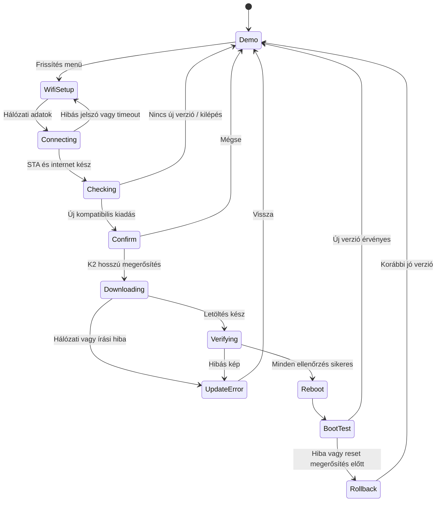

# Kormánydemó v0.1 – funkcionális és műszaki terv

Dátum: 2026-09-27. Állapot: első fejlesztési terv, még nincs lefordított vagy hardveren ellenőrzött custom firmware. Alap: [rendszerarchitektúra](system-design.md), [közös szerződések](contracts.md), [agentek](../../agents/README.md).

## 1. Cél és választott megoldás

Önállóan futó ESP32-S3 kormánydemót készítünk, amely bemutatja a TFT-t és animációit, mindkét LED-láncot, két gombot, a haptikus visszajelzést és a rendelkezésre álló mozgásszenzort. Az első teljes demó része a telefonos Wi-Fi-beállítás, GitHub Releases frissítéskeresés, helyi megerősítés, tényleges OTA és hibás új verzió esetén visszaállás. A fordulatszám szimulált; ehhez nem kell autó vagy LILYGO.

A felhasználó új hardveradata: **mindkét LED-lánc utolsó LED-je a hozzá tartozó gombot világítja meg**. A jelenlegi 24 elemű láncokból ezért 23–23 LED a fordulatszámcsík, 1–1 a külön gombvilágítás. Ez felhasználói információ, a fizikai sorrend tesztje még szükséges.

Lehetséges megközelítések:

| Megoldás | Előny | Korlát |
|---|---|---|
| **ESP-IDF + LVGL + saját vékony hardverport** | Közvetlen task-, memória- és DMA-kezelés; jól elválasztható komponensek | Több kezdeti integráció; ezt választjuk |
| Arduino alapú demó | Rövidebb kezdeti perifériapróba | Kevésbé egységes platform- és frissítési keret a tervezett rendszerhez |
| Saját grafikus motor | Szűk demóhoz kevés absztrakció | Menü, fókusz és animáció újraírása; eltér az LVGL-követelménytől |

Tervezett kiinduló verziók: ESP-IDF **6.1**, LVGL **9.4.0**, espressif/led_strip **3.0.3**. A verziók létezését ellenőriztük, a kombináció buildje még nem történt meg. A buildfeladat kompatibilitási próbát végez, rögzíti a pontos csomagokat és tranzitív függőségeket; kompatibilitási hiba esetén a komponenseket a 6.x API-khoz igazítja, nem áll vissza automatikusan 5.x-re. [IDF kiadás](https://github.com/espressif/esp-idf/releases/tag/v6.1), [LVGL kiadás](https://github.com/lvgl/lvgl/releases/tag/v9.4.0), [LED komponens](https://components.espressif.com/components/espressif/led_strip/versions/3.0.3/readme)

A felhasználó előírása ESP-IDF 6.x. A 2026-09-27-én ellenőrzött legújabb stabil kiadás v6.1, ezért ezt a taget rögzítjük; nem mozgó master/stable ágat. Az első build külön ellenőrzi az LCD/SPI, RMT, I²C, NimBLE és HTTPS/kriptográfiai integrációt a 6.1 API-k ellen. Az LVGL és led_strip fenti verziói kompatibilitási próbára váró jelöltek.

## 2. Képernyők és kétgombos kezelés

320 × 172 képpont, sötét háttér, nagy fordulatszám, kis státuszsáv és a két gomb aktuális jelentése. A normál animáció kis képernyőterületet változtat. Az animációk időalapúak, megszakíthatók, nem késleltetik a gombeseményeket.

| Oldal | Bemutatott működés |
|---|---|
| Műszerfal | DEMO felirat, szimulált RPM, animált fordulatszámcsík, változó számok |
| Menü | Rövid, 120–180 ms-os fókuszmozgás, jól olvasható kijelölés |
| LED-teszt | Külön láncazonosítás, egyenkénti végigléptetés, színek, RPM-animáció, külön gombvilágítás |
| Gombok és haptika | Gombállapot, eseményszámláló, rövid rezgéspróba |
| Mozgásszenzor | Azonosító, elérhetőség, kalibráció/érvényesség, tengelyadatok és kis dőlésjelző |
| Bluetooth-teszt | Kérésre BLE-keresés, ismert tesztpartnerhez kapcsolódás és számozott teszttelemetria; partner nélkül ezt egyértelműen jelzi |
| Teljesítmény | Valós render/flush statisztika, UI-periódus, heap-minimum, sorvesztések |
| Frissítés | Wi-Fi-beállítás, verziókeresés, jóváhagyás, előrehaladás és eredmény |
| Névjegy | Verzió, buildazonosító, boardprofil, újraindítás oka |

K1 rövid: következő elem. K2 rövid: kiválasztás/aktiválás. K1 hosszú, 700 ms: vissza; a műszerfalról megnyitja a menüt. K2 hosszú: alapértelmezetten nincs külön művelet, csak kifejezett megerősítő képernyőn használjuk. A rövid esemény felengedéskor keletkezik, és hosszú lenyomás után nem keletkezik újabb rövid esemény. Nincs automatikus ismétlés az első verzióban.

Debounce induló érték 15 ms, mintavétel 5 ms. A stabil lenyomásra azonnal helyi vizuális visszajelzés és 20 ms-os motorvezérlő impulzus jár, nem kell a felengedésre várni. A motor mechanikai válaszidejét külön mérjük; a 20 ms csak a kiadott elektromos impulzus. Minimum 100 ms impulzusindítási távolság, maximum 100 ms motorbekapcsolás bármely gördülő másodpercben. A visszajelzés nem nő korlátlan várakozó sorba. Induláskor, hibánál és OTA-írás alatt motor kikapcsolva.

## 3. LED- és szenzorbemutató

Logikai pixelcsoportok: `rpm_left[23]`, `rpm_right[23]`, `button_k1`, `button_k2`. A fizikai lánc és irány boardprofilban van; a feltételezett utolsó pixel nullától számozva 23. Láncazonosító teszt igazolja, melyik GPIO melyik oldalt és gombot hajtja. A futófény és váltásjelzés kizárólag az RPM-csoportot írhatja.

Demó alapértékek: 800–7000 RPM, 12 másodperces felfutás, 2 másodperces magas tartomány, 4 másodperces visszaesés. A LED-töltés 2000–6500 RPM között nő 0-ról 23 pixelre oldalanként, mindkét oldal kívülről befelé. Zöld → sárga → piros színmezők, tört pixelre fényerő-átmenet. 6500 RPM-től 4 Hz-es szinkron villogás, kikapcsolása 6350 alatt, hogy ne rezegjen a küszöb körül. Ezek szemléltető értékek, nem az N52 optimális váltási pontjának állításai. A valós határokat később a járműprofil adja.

A gombvilágítás alacsony állandó fény, lenyomáskor rövid fényerőemelés; OTA-kérdésnél a megerősítő gomb kaphat külön jelzést. Alap fényerőlimit 10% a kezdeti hardverpróbán; ez nem bizonyíték a tápkör terhelhetőségére. Fényerőemelés előtt áramfelvételt kell mérni.

A szenzor induláskor korlátozott I²C-próbát és chipazonosítást kap. BNO055 esetén 25 Hz-es adatolvasás, legfeljebb 20 Hz-es képernyőfrissítés; az animáció köztes állapotokat interpolálhat. Hiányzó vagy eltérő eszköz esetén „nem elérhető”, hibás kalibrációnál minőségjelzés jelenik meg. Kitalált mérési érték nem jelenhet meg valósként. A kormány orientációját nem nevezzük járműiránynak.

## 4. Komponensek és magok

A könyvtárak nem önmagukban maghoz kötöttek: **az őket hívó taskokat és egyes driverek konfigurációját kötjük maghoz**. Nem készül két LVGL-példány vagy két, egymás objektumait módosító renderelő.

| Tervezett hely | Felelősség és függőség | Agent |
|---|---|---|
| `boards/wheel_cvs8161/` | GPIO, aktív szint, LED-térkép, kijelzőparaméterek | Integrátor |
| `firmware/wheel/main/` | Indítás és komponensösszeállítás | Integrátor |
| `firmware/wheel/components/wheel_platform/` | Taskok, memória, watchdog, mérési pontok | Platform |
| `firmware/wheel/components/display_port/` | esp_lcd, SPI, DMA, LVGL flush adapter | Platform |
| `firmware/wheel/components/wheel_ui/` | LVGL képernyők, animáció, inputfókusz | UI |
| `firmware/wheel/components/wheel_io/` | Gombok, led_strip/RMT, motor, időzítések | Periféria |
| `firmware/wheel/components/motion/` | I²C és szenzorazonosítás/adatok | Periféria |
| `firmware/wheel/components/demo_source/` | Determinisztikus szimulált telemetria | Integrátor |
| `components/service_wifi/` | AP/STA, hálózatkeresés, helyi weboldal, beállítás | Wi-Fi/OTA |
| `components/update_manager/` | GitHub, manifest, ellenőrzés, letöltés, bootellenőrzés | Wi-Fi/OTA |
| `components/settings/` | Verziózott, korlátozott konfiguráció és Wi-Fi-adatok | Wi-Fi/OTA |
| `components/ble_link/` | Kormány central diagnosztika és tesztpartner-kapcsolat | BLE |
| `components/contracts/` | Események, állapotok, verziózott interfészek | Integrátor |
| `tests/`, `tools/release/` | Integráció, időmérés, manifest és kiadási ellenőrzés | QA; release eszközök: integrátor |

A `main` kizárólag összeköt; a UI nem include-ol Wi-Fi drivert, a hálózati komponens nem include-ol LVGL-t. A harmadik féltől származó könyvtárak kezelt komponensek, nem bemásolt forrásfák. Minden saját komponens külön CMake-célt, nyilvános include-könyvtárat és helyi teszteket kap. A függőséglista és lockfile verziókövetett.

| Task | Mag | Induló prioritás | Végrehajtás |
|---|---:|---:|---|
| `wheel_input` | 1 | 6 | 5 ms mintavétel; rövid, nem blokkoló eseményképzés |
| `wheel_ui` | 1 | 5 | Egyetlen LVGL-tulajdonos; 60 Hz körüli animációs cél |
| `wheel_effects` | 1 | 4 | 50 Hz LED-állapot, véges haptika, hardveres kimenet |
| `demo_source` | 0 | 3 | 50 Hz állapot; sem rajzolás, sem GPIO |
| `motion` | 0 | 2 | 25 Hz, korlátozott tranzakcióidő |
| BLE host/vezérlő | 0 | IDF által rögzített | Külön indított diagnosztika, rövid callbackek |
| `wifi_service` és HTTP feldolgozás | 0 | 3 | Eseményvezérelt, HTTP-kérésből hosszú munka külön sorba |
| `update_worker` | 0 | 2 | Egyetlen OTA-művelet, darabolt letöltés, előrehaladási esemény |
| Statisztika és beállításmentés | 0 | 1 | Ritka, korlátozott munka |

A számok az alkalmazástaskok kezdeti tervei; a rendszerfeladatok prioritását nem írjuk felül vakon. A Wi-Fi-driver CPU0-ra konfigurált. A v0.1 BLE-diagnosztikája külön indítható: central keresés és egy teszt GATT-szervertől számozott telemetria fogadása. A tesztpartner lehet fejlesztői gép vagy másik ESP32; a teljes kétoldali kapcsolat így ellenőrizhető, de az önálló RPM-demónak nem előfeltétele. Ismert tesztpartner megszakítása után az újracsatlakozást is mérjük. A végleges járműprotokollt ez nem helyettesíti. Wi-Fi-karbantartás előtt a BLE-diagnosztika leáll és bont; a meglévő rendszerterv egyidejű BLE+Wi-Fi együttélését ez a demó nem igazolja.

LVGL csak a `wheel_ui` taskból hívható, kivéve az adott verzió dokumentáltan megengedett időzítési/flush mechanizmusait. Flush-befejezés rövid eseményként jut vissza; az adapter nem tarthat fenn olyan várakozást, amely a saját eseményét feldolgozó UI-taskot blokkolja. [LVGL szálkezelés](https://lvgl.io/docs/open/9.4/details/integration/overview/threading)

Kijelző: RGB565, 40 MHz SPI, két 15 360 bájtos DMA-puffer a belső RAM-ban. UI-erőforrások szükség szerint PSRAM-ban, taskvermek és DMA-területek kezdetben belső memóriában. Nincs képkockánként dinamikus objektumépítés. A teljes képernyő 22,016 ms-os nyers átviteli korlátja megmarad; kis területű 60 Hz animáció, teljes képes átmenetnél 30 FPS cél.

## 5. Telefonos Wi-Fi-beállítás

1. A kormány menüjében „Frissítés” → „Wi-Fi beállítása”. A demó animáció leáll, a perifériák nyugodt állapotba kerülnek.
2. A modul létrehoz egy `E90-Wheel-XXXX` hálózatot, munkamenetenként véletlen WPA2-jelszóval. SSID, jelszó és `http://192.168.4.1` megjelenik a kijelzőn; a kétgombos kezeléssel lapozható, ha nem fér el.
3. A telefon erre kapcsolódik. A portál automatikus megnyílása kényelmi lehetőség, a kézi cím mindig használható. A telefon „nincs internet” jelzése ebben a szakaszban várható; az oldalon nincs külső CDN vagy internetet igénylő erőforrás.
4. AP+STA módban a modul aszinkron hálózatkeresést végez. A weboldal SSID-t, jelerősséget és védelmi módot mutat, kézi rejtett-SSID bevitellel. Első körben 2,4 GHz WPA2-Personal hálózat támogatott; vállalati és bejelentkezős hotspot nem.
5. A felhasználó megadja az otthoni/router/hotspot jelszót. A modul csatlakozik, DHCP-címet kér, majd külön ellenőrzi a frissítési szolgáltatás elérhetőségét. A helyi hálózati csatlakozás és az internetelérés két külön státusz.
6. Sikeres DHCP után az új konfiguráció megőrizhető; sikertelen próbálkozás nem írja felül az utolsó működő hálózatot. Internet nélkül marad az „újrapróbálás / másik hálózat / vissza” választás.
7. A TFT lesz az elsődleges státuszkijelző. A beállító AP rövid türelmi idő után leáll; a modul STA módban marad a frissítéshez. A telefonra a továbbiakhoz nincs szükség.

AP+STA csatornaváltáskor a telefon kapcsolata megszakadhat, ezért a weboldal nem feltételez egyetlen folyamatos HTTP-kapcsolatot. Újracsatlakozás után állapotot kérdez le, a mentés egyedi kérésazonosítóval idempotens. Ugyanazon telefon saját hotspotjára történő átállásnál szükség lehet manuális váltásra; első elfogadási teszt külön routerrel vagy második eszköz hotspotjával történik. [Espressif Wi-Fi módok](https://docs.espressif.com/projects/esp-idf/en/stable/esp32s3/api-guides/wifi-driver/wifi-modes.html)

A helyi oldal csak a beállító AP interfészén érhető el. Módosítások munkamenethez kötött tokennel és méretkorláttal; SSID-k HTML-escape-elve, jelszó sosem kerül GET-paraméterbe vagy naplóba. Az AP véletlen jelszava és fizikai menüből történő indítása korlátozza a hozzáférést. Flash titkosítás nélkül az NVS-ben tárolt hálózati jelszó fizikai kiolvasás elleni védelmét nem állítjuk. „Mentett hálózat törlése” menüpont kötelező.

Beállításnál 5 perc felhasználói inaktivitás után AP-leállítás, aktív csatlakozási próbát legfeljebb 30 másodpercig várunk. Kilépéskor Wi-Fi leáll és visszatér a demó. Meglévő hálózattal a „Frissítés keresése” kihagyhatja a beállító AP-t; az külön újraindítható marad.

## 6. GitHub Releases és OTA

Kötelező kiegészítés: [stabil közös OTA-helyreállítási csatorna](ota-recovery-v1.md). A kormány hitelesített, titkosított BLE-kapcsolaton osztja meg a Wi-Fi-adatokat a belső egységgel, amely saját maga ellenőrzi és telepíti a saját képét. Közös frissítésnél először a belső egység sikeres újraindulását ellenőrizzük, majd frissülhet a kormány. Az alkalmazásprotokoll eltérése nem tilthatja le ezt a külön szolgáltatást. A v1 OTA-protokollt törő változás csak kifejezett fejlesztői engedéllyel készülhet. A korábbi BLE-leállási szabály az önálló diagnosztikára vonatkozik; páros OTA alatt a recovery kapcsolatnak meg kell maradnia vagy önállóan újracsatlakoznia, amit külön együttélési teszt igazol.

A választott repo: `kawapiki/bmw-led-steeringwheel-esp32`. Nyilvános kiadások, eszközön tárolt GitHub-token nélkül. Az első demó `wheel-demo` frissítési csatornát használ, amelyen publikus prerelease kiadások is lehetnek. Emiatt a kliens a releases-listát szűri, nem támaszkodik kizárólag a prerelease-eket kihagyó latest végpontra. A kiadáslista és asset URL-ek a hivatalos API-n keresztül kérdezhetők le. [GitHub Releases API](https://docs.github.com/en/rest/releases/releases)

Tervezett tagpéldák: `wheel-v0.1.0`, `wheel-v0.1.1`. Kötelező assetek:

- `wheel-demo-manifest.json`: csatorna, boardazonosító, chip, verzió, monoton kiadásszám, alkalmazásméret, SHA-256, partíciós séma, konfigurációs séma, rövid változásleírás, bináris assetnév.
- `wheel-demo-manifest.sig`: a manifest pontos bájtjainak aláírása, ellenőrzött szabványos kriptográfiai könyvtárral.
- `wheel-demo-<version>-signed.bin`: aláírt **alkalmazáskép**, nem a teljes flashmentés.

A buildbe rögzített nyilvános ellenőrző kulcs tartozik; privát aláíró kulcs nem kerül repóba vagy készülékre. Az alkalmazás saját leírója tartalmazza a board-, séma- és kiadásszámot is, hogy az aláírt képet a manifesttel össze lehessen vetni. A SHA-256 önmagában nem helyettesíti a hitelességellenőrzést. A v0.1 nem változtat eFuse-t, nem aktivál hardveres Secure Bootot vagy hardveres anti-rollbacket. Az ESP-IDF támogat aláírt OTA-kép ellenőrzést hardveres Secure Boot nélkül is; ennek konkrét buildbeállítását tesztben ellenőrizzük. [Espressif aláírt alkalmazások](https://docs.espressif.com/projects/esp-idf/en/stable/esp32s3/security/secure-boot-v2.html)

Kereséskor legfeljebb 3 oldal × 20 release vizsgálható, korlátozott HTTP-válaszmérettel és fokozatos feldolgozással. Hiányos kiadás kimarad; az azonos nevű többszörös asset hibás. A legnagyobb kompatibilis, hitelesített kiadásszám ajánlható fel, nem lexikografikus verzió-összehasonlítás. A publikálás biztosítsa, hogy a támogatott frissítés ebben az ablakban legyen. Rate limit és kapcsolatvesztés felhasználói hibastátusz, nem végtelen gyors újrapróbálkozás. Nincs háttérben folyamatos frissítéskeresés.

Az HTTPS-tanúsítvány és hostnév ellenőrzése kötelező. GitHub/CDN HTTPS-átirányításokat korlátozott számban kezelünk, minden lépésnél érvényes TLS-sel; HTTP-re visszaváltás tiltott. A pontos assetet és hash-t a jóváhagyott manifestből rögzítjük, telepítés közben nem követjük újra a „legfrissebb” verziót. Az óra érvényességét hálózati idővel és ésszerű időkorláttal ellenőrizzük; időhiba esetén érthető hibát adunk, nem kapcsoljuk ki a TLS-ellenőrzést. [ESP HTTPS OTA](https://docs.espressif.com/projects/esp-idf/en/stable/esp32s3/api-reference/system/esp_https_ota.html)

A TFT-n megjelenik az aktuális és új verzió, rövid leírás, majd „Telepíted?”. Alapválasztás Mégse. Telepítés csak a frissen megnyitott kérdésen, felengedett gombok után indított K2 700 ms-os nyomvatartásra kezdődik. A portál nem erősítheti meg helyette. A folyamat százalékot és szakaszt mutat; a telefon leválása nem szakítja meg.

Letöltés közben a kilépési kérés szabályosan megszakítja az OTA-t a következő darabhatáron, a régi bootpartíció megtartásával. Ellenőrzés/bootkijelölés/újraindítás rövid, nem megszakítható szakaszában a UI ezt jelzi. A v0.1 megszakított letöltést újrakezd, nem valósít meg részleges folytatást.

## 7. Partíció, visszaállás és első telepítés

32 MiB flashre két, egyenként 6 MiB-os OTA alkalmazáshelyet tervezünk, külön otadata és NVS területtel. A pontos offseteket a buildfeladat állítja össze és ellenőrzi a bootloader tényleges méretével. Az első verzió képei, betűi és weboldala az alkalmazáskép részei, így a hozzájuk tartozó kód és erőforrások együtt cserélődnek. Nincs külön, helyben felülírt UI-assetpartíció.

Az új kép az inaktív helyre kerül; csak teljes ellenőrzés után válhat bootcéllá. A bootloader rollback támogatása engedélyezett. Első induláskor legfeljebb 15 másodperces automatikus önteszt: belső memória, konfiguráció olvashatósága, UI heartbeat, legalább egy sikeres kijelzőátvitel, input-task heartbeat és motor kikapcsolt alapállapot. Ez nem bizonyítja a pixelek fizikai láthatóságát; azt külön hardverteszt igazolja. Hiányzó opcionális szenzor vagy internet nem okoz rollbacket. Siker után érvényesítés, hiba vagy megerősítés előtti reset esetén visszaállás. [ESP-IDF OTA és rollback](https://docs.espressif.com/projects/esp-idf/en/stable/esp32s3/api-reference/system/ota.html)

A konfiguráció migrációja nem törölheti az előző firmware által még szükséges adatokat az új kép érvényesítése előtt. Az első kiadás önmagában még nem ad korábbi custom képre visszaállási lehetőséget: a rollback teszt v0.1.0 → v0.1.1 frissítéssel történik.

Az eredeti kínai firmware nem része az A/B láncnak. A teljes 32 MiB-os mentés megmarad külső visszaállítási alapként; az új partíciós kiosztás első telepítése USB-s művelet lesz, külön konkrét flashtervvel. E dokumentum készítése nem indít hardverműveletet.

## 8. Ellenőrzési feltételek

| Vizsgálat | Elvárt eredmény |
|---|---|
| 1000 gombesemény normál animáció közben | Fizikai él → helyi visszajelzés p95 ≤ 50 ms, p99 ≤ 80 ms; nincs duplázás/beragadás |
| Részleges menüanimáció | Képkockaperiódus p95 ≤ 20 ms, p99 ≤ 33 ms, rögzített jeleneten |
| 30 perces RPM + LED + szenzor demó | Nincs watchdog-reset, sorfelhalmozódás vagy növekvő memóriafogyás |
| Gomb-LED elkülönítés | RPM-futófény és villogás sosem írja a két gombpixel állapotát |
| Haptika | Véges impulzusok, duty limit, reset és hiba után motor kikapcsolva |
| Szenzor hiányzik / I²C timeout | Menü és gombok működnek, diagnosztika hibát jelez |
| BLE-tesztpartner, majd kapcsolatvesztés | Számozott minták követhetők, régi adat elavul, újrakapcsolódás mérve; nincs UI-megakadás |
| Telefonos beállítás | Android és iOS böngésző; rossz jelszó, rejtett SSID, ismételt POST, AP-csatornaváltás és internet nélküli router kezelése |
| Frissítéskeresés | Nincs kiadás, prerelease, hibás manifest, rate limit, nem kompatibilis board/séma külön kezelve |
| Jóváhagyás | Régi vagy lenyomva maradt gombesemény nem indít telepítést |
| v0.1.0 → v0.1.1 OTA | Verzióváltás látható, konfiguráció megmarad, új kép érvényesítve |
| Sérült/aláíratlan/túlméretes kép | Elutasítva; korábbi bootcél megmarad |
| Hálózat- és tápvesztés | Félbehagyott letöltés mellett régi kép indul; hibás új boot után rollback |
| 8 órás stabilitási próba | Nincs megmagyarázatlan reset vagy fokozatos heapvesztés |

Wi-Fi-beállítás alatt cél a folyamatosan kezelhető státuszoldal. Flashírás idejére nem vállalunk normál 60 Hz-es animációt: egyszerű, legfeljebb 5 Hz-es haladáskijelzés, kikapcsolt haptika és nyugodt LED-ek. A flashműveletek mindkét mag működésére hatással lehetnek; ezt nem oldja meg önmagában az OTA-task CPU0-ra kötése.

## 9. Megvalósítási munkacsomagok

Ez a rész első ütemezési terv, nem kész forráskódot helyettesítő, soronként végrehajtható implementációs leírás. Minden csomag külön ellenőrizhető eredményt ad; a teljes v0.1 csak az OTA-próba után kész.

| Sorrend | Tulajdonos | Konkrét eredmény és fájlterület | Elfogadási kapu |
|---|---|---|---|
| M1 | Integrátor + platform | `firmware/wheel/CMakeLists.txt`, `sdkconfig.defaults`, `partitions.csv`, `main/`, boardprofil, kezelt komponensek és lockfile | Reprodukálható ESP32-S3 build; két OTA-slot; tiltott eFuse-beállítások ellenőrzése; méretjelentés |
| M2 | Platform | `display_port/`, `wheel_platform/` | Színteszt, orientáció, flush ownership és DMA mérése; CPU/task statisztika |
| M3 | Periféria | `wheel_io/`, `motion/` | Két gomb, 46 RPM-pixel + 2 gombpixel, véges haptika, szenzorazonosítás és hiányteszt |
| M4 | UI + integrátor | `wheel_ui/`, `demo_source/` | Teljes kétgombos menü és animált demó; először szimulált perifériákkal, majd M2/M3-mal |
| M4b | BLE | `components/ble_link/`, `tests/integration/` külön kiosztott BLE-tesztterülete | Central diagnosztika, tesztpartner, adatfogadás és újracsatlakozás; Wi-Fi-módba lépéskor rendezett leállás |
| M5 | Wi-Fi/OTA | `service_wifi/`, `settings/`, beágyazott portál | Telefonos AP-beállítás, aszinkron scan, mentett hálózat, hibás jelszó és újracsatlakozás |
| M6 | Wi-Fi/OTA + integrátor | `update_manager/`, `tools/release/` | GitHub-kiadás kiválasztás, aláírásellenőrzés, megerősítés, A/B frissítés és bootönteszt |
| M7 | QA + integrátor | `tests/integration/`, `tests/performance/`, `docs/validation/` | v0.1.0 → v0.1.1, hibás új kép rollbackje, memória- és válaszidőjelentés |

M1 után M2, M3 és M5 párhuzamosítható. M4 szimulált adapterekkel dolgozhat, M6 a közös update-állapotok és M5 interfésze után kapcsolható be. Egy hardverpanelhez egyszerre egy agent fér hozzá. A koordinátorral együtt maximum négy futó agent; a UI szerepkör szükség szerint váltja a platformagentet a következő hullámban.

Közös, M1-ben rögzítendő interfészek: `DemoTelemetry`, `InputEvent`, `MotionState`, `BleDiagnosticState`, `WifiState`, `UpdateState`, `UpdateCandidate`, `UiIntent`; állapotokhoz legfrissebbérték-postafiók, parancsokhoz korlátozott sor. A UI kizárólag intentet küld; a worker állapotot publikál. Az update candidate verzióhoz/hash-hez kötött azonosítója megakadályozza, hogy a megerősítés másik kiadást indítson.

Az első flash előtt külön ellenőrzendő a boardprofil, a panel init/offset, a PSRAM konfiguráció, a partícióhatárok és a visszaállítási csomag. A GitHub Releases cél elfogadott; kiadás feltöltése és aláírókulcs létrehozása e terv készítésekor még nem történt meg.
