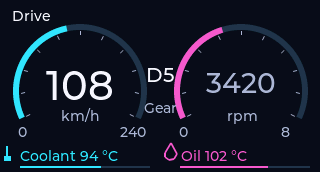
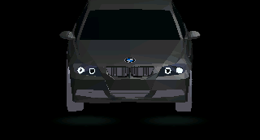
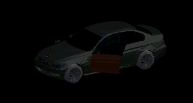
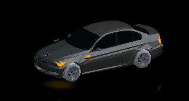
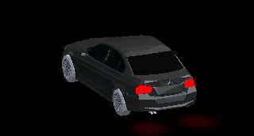

# Operational E90 cockpit and dynamic 3D view

The wheel renders gateway telemetry with LVGL and TGX 1.1.4 on ESP-IDF 6.1. Only the gateway simulates vehicle data; BMW CAN decoding/electrical compatibility and seat control remain unqualified. The original firmware backup is unchanged.

## Native-size gallery

These 320x172 images are captures of the actual production LVGL/TGX code running in the host harness, not photographs of the physical display. They illustrate appearance; they do not prove display FPS or LED brightness.

### Drive: speed, RPM, gear and temperatures

### Boot: angel eyes, black metallic body reveal, then drift

### Automatic opening view with subtly red open-door paint

Fresh known openings automatically show the car from Drive/Sport; closing returns to the underlying instrument page. RPM, temperatures and other valid telemetry continue independently. RPM remains visible on the LED strips. Service/OTA takes priority; unknown closure state never becomes a false closed state.

### On-model indicators, including front fenders

### Rear brake lamps and reflected light

## Current rendering and controls

The actual 3100-triangle E90 mesh has independently articulated doors, hood and trunk, rotating wheels, and geometric hood/trunk roundels. Wheels retain 261–262 triangles each. Camera focus follows openings and active lights. Black paint uses bounded metallic highlight cues; glass and trim have separate materials. Lamp emission and stylized ground reflections follow valid incoming state, including the gateway blink phase. Successful 3D scenes use the full screen without text or separate lamp icons.

The interruptible five-second intro starts dark/front-on, illuminates angel eyes, reveals and zooms the body, then drifts out of view. This is a decorative boot sequence, separate from live vehicle state.

Each LED chain reserves physical pixel 0 for its button and pixels 1–23 for RPM. The bar has amber low-RPM indication, green progression and four increasingly red end pixels. Fractional coverage fades the boundary pixel in both directions. The accelerating falling peak blends between adjacent pixels. Invalid/stale or maintenance data clears the RPM effect. The gateway keeps RPM changing during stationary/P door demonstrations.

## Resources and evidence

One UI task owns TGX and LVGL. RGB565/depth buffers occupy 220,160 bytes of PSRAM; existing internal LCD DMA buffers remain separate. Geometry occupies 124,000 bytes plus wheel pivots. No per-frame allocation or new texture buffers. Static scenes stop rendering; service/OTA pauses 3D.

Latest joint bench results: CPU render average 67.619 ms, maximum 81.526 ms; internal heap minimum 76,100 bytes and UI stack low-water 1,052 bytes. These are CPU measurements, not panel FPS or input-latency qualification. Both USB application writes and boot self-tests passed. Exact-build Wi-Fi/OTA requalification and visual confirmation of the newest LED smoothness remain pending.

- [Latest telemetry/LED validation and image hashes](../../validation/2026-09-28-smooth-rpm.md)
- [Wheel detail validation](../../validation/2026-09-28-wheel-detail.md)
- [Runtime architecture](../../architecture/runtime3d-v1.md)
- [Operational wheel and lighting contract](../../architecture/operational-wheel-lighting-v1.md)
- [Model attribution and license](../../../assets/ui/e90/ATTRIBUTION.md)

The original Blender source is unchanged. The community mesh, hinge angles, lamp division and exaggerated roundels are illustrative, not measured BMW CAD. Model attribution remains required. The earlier frame atlas and runtime-plan.md are historical prototypes, no longer linked into firmware. The frozen OTA recovery protocol remains backward compatible; this work does not enable CAN transmission or seat motion.
